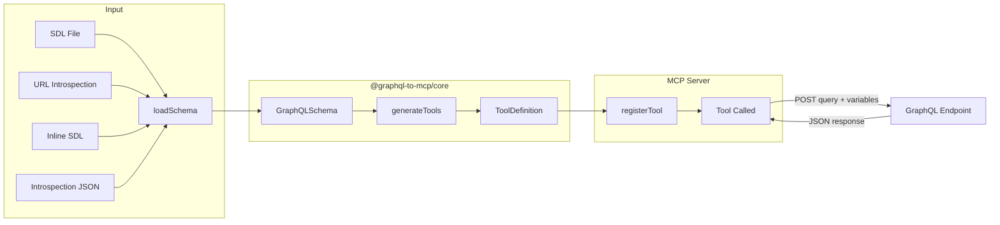

# graphql-to-mcp

[](https://www.npmjs.com/package/graphql-to-mcp) [](https://www.npmjs.com/package/graphql-to-mcp)
[](https://www.typescriptlang.org/) [](https://github.com/KKonstantinov/graphql-to-mcp/blob/main/LICENSE)

Convert GraphQL schemas and endpoints into [Model Context Protocol](https://modelcontextprotocol.io/) (MCP) servers. Point at any GraphQL API and get an MCP server with tools mapped from queries and mutations.

## Features

- **Zero config proxy** — pass a GraphQL endpoint URL and get an MCP server with every query as a tool
- **Library mode** — add GraphQL-backed tools to your existing TypeScript MCP server with one function call
- **Mutation control** — expose all mutations, none, or an explicit whitelist
- **MCP tool annotations** — queries get `readOnlyHint: true`, mutations get `destructiveHint: true`
- **Multiple schema sources** — SDL files, globs, introspection JSON, inline SDL strings, or live URL introspection
- **Multi-endpoint** — combine multiple GraphQL APIs into a single MCP server with prefix-based namespacing
- **Include/exclude filters** — cherry-pick which operations become tools
- **ESM only** — modern, tree-shakeable, with complete TypeScript types

## Quick Start

### Proxy Mode

Run against a live GraphQL endpoint (introspects the schema automatically):

```bash
npx graphql-to-mcp https://api.example.com/graphql
```

Or from a local SDL file:

```bash
npx graphql-to-mcp schema.graphql -e https://api.example.com/graphql
```

### Library Mode

Add GraphQL tools to an existing MCP server:

```typescript
import { McpServer } from '@modelcontextprotocol/sdk/server/mcp.js';
import { StdioServerTransport } from '@modelcontextprotocol/sdk/server/stdio.js';
import { registerGraphQLTools } from '@graphql-to-mcp/lib';

const server = new McpServer({ name: 'my-server', version: '1.0.0' });

// Register your own tools alongside GraphQL tools
registerGraphQLTools(server, {
    source: 'schema.graphql',
    endpoint: 'https://api.example.com/graphql'
});

const transport = new StdioServerTransport();
await server.connect(transport);
```

## Packages

This is a monorepo managed with [pnpm workspaces](https://pnpm.io/workspaces):

| Package                                  | Description                                                           |
| ---------------------------------------- | --------------------------------------------------------------------- |
| [`graphql-to-mcp`](packages/proxy/)      | Standalone CLI proxy — point at a GraphQL endpoint, get an MCP server |
| [`@graphql-to-mcp/core`](packages/core/) | Shared conversion engine (GraphQL schema to MCP tool definitions)     |
| [`@graphql-to-mcp/lib`](packages/lib/)   | Library for integrating into existing TypeScript MCP servers          |

## How It Works



1. **Load** — read a GraphQL schema from an SDL file, introspection JSON, inline string, or live URL introspection
2. **Parse** — build a `GraphQLSchema` object using the `graphql` library
3. **Generate** — walk every Query and Mutation field, mapping arguments to Zod schemas, building field selections, and producing `ToolDefinition` objects with names, descriptions, annotations, and pre-built query documents
4. **Register** — add each tool to an `McpServer`. When an AI agent calls a tool, the server executes the corresponding GraphQL operation against the endpoint and returns the result as JSON

## Runtime Compatibility

| Runtime | Version | Status |
| ------- | ------- | ------ |
| Node.js | >= 24   | Tested |
| Bun     | >= 1.2  | Tested |
| Deno    | >= 2.0  | Tested |

## Development

```bash
pnpm install
pnpm build
pnpm test
```

## License

MIT
