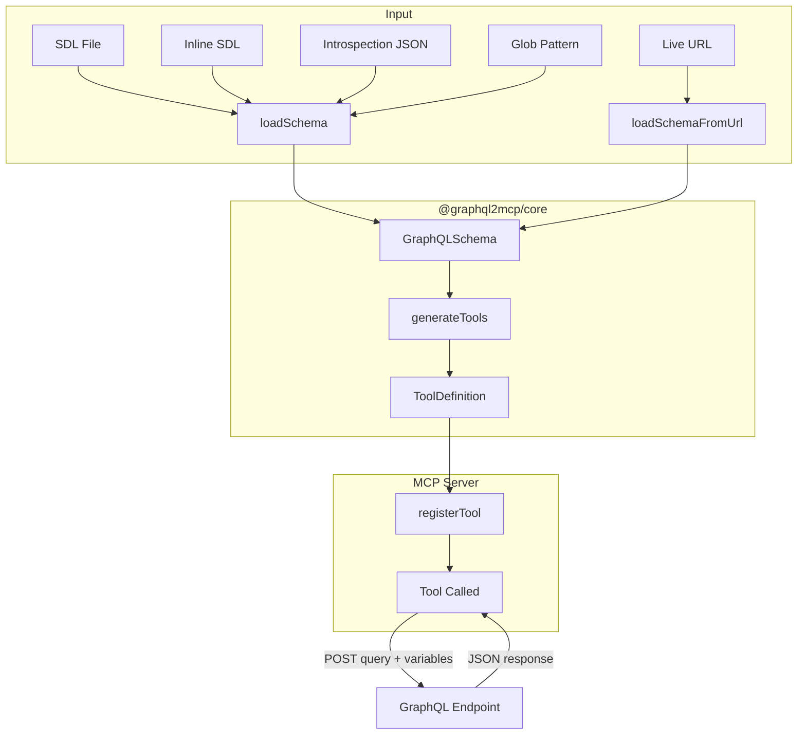

# graphql2mcp

[](https://www.npmjs.com/package/graphql2mcp) [](https://www.npmjs.com/package/graphql2mcp)
[](https://www.typescriptlang.org/) [](https://github.com/KKonstantinov/graphql2mcp/blob/main/LICENSE)
[](https://graphql2mcp.vercel.app/docs)

Convert GraphQL schemas and endpoints into [Model Context Protocol](https://modelcontextprotocol.io/) (MCP) servers. Point at any GraphQL API and get an MCP server with tools mapped from queries and mutations.

## Features

- **Library mode** — add GraphQL-backed tools to your existing TypeScript MCP server with one function call
- **Zero config proxy** — pass a GraphQL endpoint URL and get an MCP server with every query as a tool
- **Mutation control** — expose all mutations, none, or an explicit whitelist
- **MCP tool annotations** — queries get `readOnlyHint: true`, mutations get `destructiveHint: true`
- **Multiple schema sources** — SDL files, globs, introspection JSON, inline SDL strings, or live URL introspection
- **Multi-endpoint** — combine multiple GraphQL APIs into a single MCP server with prefix-based namespacing
- **Include/exclude filters** — cherry-pick which operations become tools
- **ESM only** — modern, tree-shakeable, with complete TypeScript types

## Quick Start

### Library Mode

Add GraphQL tools to an existing MCP server:

```typescript
import { McpServer } from '@modelcontextprotocol/sdk/server/mcp.js';
import { StreamableHTTPServerTransport } from '@modelcontextprotocol/sdk/server/streamableHttp.js';
import { registerGraphQLTools } from '@graphql2mcp/lib';

const server = new McpServer({ name: 'my-server', version: '1.0.0' });

// Register your own tools alongside GraphQL tools
registerGraphQLTools(server, {
    source: 'schema.graphql',
    endpoint: 'https://api.example.com/graphql'
});

const transport = new StreamableHTTPServerTransport({ sessionIdGenerator: undefined });
await server.connect(transport);
```

Or use `getGraphQLTools` for full control over registration:

```typescript
import { getGraphQLTools } from '@graphql2mcp/lib';

const { tools } = getGraphQLTools({
    source: 'schema.graphql',
    endpoint: 'https://api.example.com/graphql'
});

for (const tool of tools) {
    server.registerTool(
        tool.name,
        {
            title: tool.title,
            description: tool.description,
            inputSchema: tool.inputSchema,
            annotations: tool.annotations
        },
        tool.handler
    );
}
```

### Proxy Mode

Run against a live GraphQL endpoint (introspects the schema automatically):

```bash
npx graphql2mcp https://api.example.com/graphql -t http
```

This starts a Streamable HTTP MCP server on port 3000. For stdio transport (used by Claude Desktop, Cursor), omit the `-t http` flag:

```bash
npx graphql2mcp https://api.example.com/graphql
```

Or from a local SDL file:

```bash
npx graphql2mcp schema.graphql -e https://api.example.com/graphql -t http
```

## Packages

This is a monorepo managed with [pnpm workspaces](https://pnpm.io/workspaces):

| Package                               | Description                                                                             |
| ------------------------------------- | --------------------------------------------------------------------------------------- |
| [`@graphql2mcp/lib`](packages/lib/)   | Library for integrating into existing TypeScript MCP servers                            |
| [`@graphql2mcp/core`](packages/core/) | Shared engine — schema loading, tool generation, execution, and MCP server registration |
| [`graphql2mcp`](packages/proxy/)      | Standalone CLI proxy — point at a GraphQL endpoint, get an MCP server                   |

## How It Works



1. **Load** — read a GraphQL schema from an SDL file (or glob of multiple files), introspection JSON, inline SDL string, or live URL introspection
2. **Parse** — build a `GraphQLSchema` object using the `graphql` library
3. **Generate** — walk every Query and Mutation field, mapping arguments to Zod schemas, building field selections, and producing `ToolDefinition` objects with names, descriptions, annotations, and pre-built query documents
4. **Register** — add each tool to an `McpServer`. When an AI agent calls a tool, the server executes the corresponding GraphQL operation against the endpoint and returns the result as JSON

## Runtime Compatibility

| Runtime | Version | Status |
| ------- | ------- | ------ |
| Node.js | >= 22   | Tested |
| Bun     | >= 1.2  | Tested |
| Deno    | >= 2.0  | Tested |

## Development

```bash
pnpm install
pnpm build
pnpm test
```

## License

MIT
