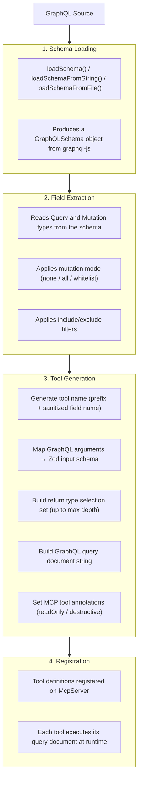
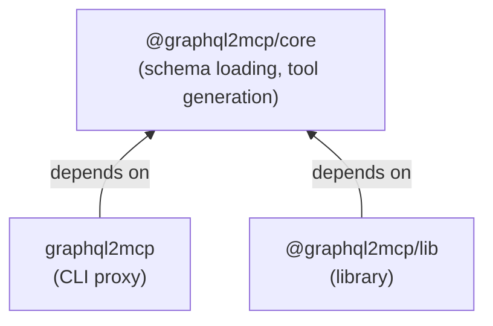

# Architecture

This document describes how `graphql2mcp` converts GraphQL schemas into MCP tool definitions and how the packages relate to each other.

## Pipeline

Every conversion follows a four-stage pipeline:



## Package Dependency Diagram



Both `graphql2mcp` (proxy) and `@graphql2mcp/lib` depend on `@graphql2mcp/core` via `workspace:*`. The core package has no dependency on either consumer.

### What each package owns

- **`@graphql2mcp/core`** -- schema loading (SDL, files, globs, introspection JSON), GraphQL-to-Zod type mapping, tool name generation, selection set building, and the `generateTools` orchestrator.

- **`graphql2mcp`** (proxy) -- CLI argument parsing (Commander), MCP server creation, transport setup (stdio and HTTP), URL introspection via `fetch`, runtime GraphQL execution, and multi-endpoint support.

- **`@graphql2mcp/lib`** -- the `registerGraphQLTools` function that takes an existing `McpServer` and registers tool handlers on it. Handles runtime GraphQL execution internally.

## Type Mapping

GraphQL input types are converted to Zod schemas for MCP tool input validation.

| GraphQL Type               | Zod Schema                               |
| -------------------------- | ---------------------------------------- |
| `String`                   | `z.string()`                             |
| `Int`                      | `z.number().int()`                       |
| `Float`                    | `z.number()`                             |
| `Boolean`                  | `z.boolean()`                            |
| `ID`                       | `z.string()`                             |
| `String!` (non-null)       | `z.string()` (required)                  |
| `String` (nullable)        | `z.string().nullish()` (optional)        |
| `[String]`                 | `z.array(z.string().nullish())`          |
| `[String!]!`               | `z.array(z.string())`                    |
| Enum                       | `z.enum(['VALUE1', 'VALUE2', ...])`      |
| Input object               | `z.object({ field1: ..., field2: ... })` |
| Unknown scalar             | `z.string()` (default fallback)          |
| Custom scalar (configured) | User-provided Zod schema                 |

Non-null types produce required fields. Nullable types produce `.nullish()` fields (optional and nullable). Enum descriptions from GraphQL are preserved in the Zod schema via `.describe()`.

### Input Object Recursion

Input objects are mapped recursively. Circular references are handled with a visited set and a maximum input depth of 10 levels. Beyond the depth limit, nested objects fall back to `z.record(z.string(), z.unknown())`.

## Selection Set Building

Return types determine what fields are requested in the generated GraphQL query document. The `depth` option (default: 3) controls how deep into nested objects the selection goes.

- **Scalar and enum fields** are always included
- **Object fields** are recursed into until `maxDepth` is reached
- **Union types** produce inline fragments with `__typename` (e.g., `... on Dog { name }`)
- **Interface types** produce shared scalar fields plus inline fragments for each implementation
- **Beyond max depth**, non-scalar fields are omitted from the selection

For example, with `depth: 2` and a `User` type that has a nested `Address` object:

```graphql
# Generated query document:
query Query_user($id: ID!) {
    user(id: $id) {
        id
        name
        email
        address {
            street
            city
            country
        }
    }
}
```

## Tool Naming

Tool names follow the pattern `{prefix}{sanitizedFieldName}`:

- Query tools: `query_users`, `query_searchProducts`
- Mutation tools: `mutation_createUser`, `mutation_deletePost`

Field names are sanitized to contain only alphanumeric characters and underscores. If a name collision occurs (e.g., across multiple endpoints), a numeric suffix is appended: `query_users_2`.

Multi-endpoint configurations can set a per-endpoint prefix to namespace tools:

```typescript
// Tools: geo_query_countries, lang_query_languages
createProxyServer({
    endpoints: [
        { source: './geo.graphql', endpoint: '...', prefix: 'geo' },
        { source: './lang.graphql', endpoint: '...', prefix: 'lang' }
    ]
});
```

## Runtime Execution

When an MCP tool is called, the proxy or library:

1. Receives the tool arguments from the MCP client
2. Sends the pre-built `queryDocument` to the GraphQL endpoint via `fetch`
3. Passes the tool arguments as GraphQL variables
4. Returns the response data as JSON text content

Errors from the GraphQL endpoint (both network errors and GraphQL errors) are returned as MCP error responses with `isError: true`.

## Design Decisions

### Why Zod for input schemas?

The MCP TypeScript SDK uses Zod for tool input schema definitions. Converting GraphQL types to Zod at build time means tool inputs are validated by the MCP SDK before reaching the GraphQL execution layer.

### Why pre-built query documents?

Each tool stores its GraphQL query document string at generation time. This avoids rebuilding queries on every tool call and ensures the selection set matches what was configured at startup.

### Why ESM only?

The project targets ES2022+ environments. ESM-only simplifies the build, eliminates dual-package hazards, and aligns with the MCP TypeScript SDK which is also ESM-only.

### Why pnpm workspaces?

pnpm's strict `node_modules` hoisting ensures each package only has access to its declared dependencies, catching missing dependency declarations early. Workspaces enable `workspace:*` for local development while publishing independent packages.
