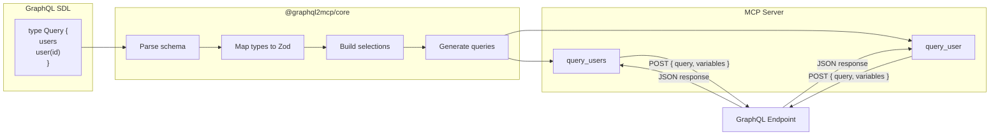

## Why?

AI agents using MCP can call tools, but most APIs speak GraphQL — not MCP. Manually writing MCP tool definitions for every GraphQL query is tedious, error-prone, and falls out of sync as schemas evolve.

**graphql2mcp** reads your GraphQL schema (from a file, URL, or inline SDL) and automatically generates MCP tools with proper input validation, descriptions, and annotations. Each query becomes a callable tool. Each argument becomes a validated Zod input. The agent calls the
tool, the tool executes the GraphQL query, and the result comes back as structured JSON.

## Quick Start

One command. No code.

```bash
npx graphql2mcp https://countries.trevorblades.com/graphql
```

This introspects the endpoint, generates MCP tools for every query, and starts a server over stdio. An AI agent connected to this server can now call tools like `query_countries` and `query_country`.

## Library Mode

Already have an MCP server? Add GraphQL tools alongside your existing tools:

```typescript
import { McpServer } from '@modelcontextprotocol/sdk/server/mcp.js';
import { registerGraphQLTools } from '@graphql2mcp/lib';

const server = new McpServer({ name: 'my-server', version: '1.0.0' });

registerGraphQLTools(server, {
    source: './schema.graphql',
    endpoint: 'https://api.example.com/graphql',
    headers: { Authorization: 'Bearer my-token' }
});
```

Every query in the schema becomes a tool. The agent sends arguments, the tool builds and executes the GraphQL query, and the result is returned as JSON text.

## Mutation Control

By default, only queries are exposed — mutations are opt-in. You can enable all mutations, or whitelist specific ones:

```typescript
// Expose only safe mutations
registerGraphQLTools(server, {
    source: schema,
    endpoint: 'https://api.example.com/graphql',
    mutations: { whitelist: ['createUser', 'updateUser'] }
});
```

Mutation tools are automatically annotated with `destructiveHint: true` and `readOnlyHint: false`, so AI agents know they're making changes.

## Multi-endpoint

Combine multiple GraphQL APIs into one MCP server with prefixed tool names:

```typescript
import { createProxyServer } from 'graphql2mcp';

const server = createProxyServer({
    endpoints: [
        {
            source: './github.graphql',
            endpoint: 'https://api.github.com/graphql',
            prefix: 'github',
            headers: { Authorization: 'Bearer gh-token' }
        },
        {
            source: './stripe.graphql',
            endpoint: 'https://api.stripe.com/graphql',
            prefix: 'stripe',
            headers: { Authorization: 'Bearer sk-token' }
        }
    ]
});
```

Tools are named `github_query_viewer`, `stripe_query_customers`, etc. — no collisions.

## How It Works



1. **Parse** — SDL string, `.graphql` file, or introspection result is loaded into a `GraphQLSchema`
2. **Map** — Each argument type is converted to a Zod schema (String to `z.string()`, Int to `z.number().int()`, enums to `z.enum()`, input objects to `z.object()`)
3. **Select** — Return types are traversed to build field selection sets with configurable depth
4. **Register** — Each query/mutation becomes an MCP tool with validated inputs, a description, and annotations

## Packages

| Package                        | Description                                                              |
| ------------------------------ | ------------------------------------------------------------------------ |
| [`graphql2mcp`](/cli)          | Standalone CLI proxy — run any GraphQL endpoint as an MCP server         |
| [`@graphql2mcp/lib`](/library) | Library for adding GraphQL tools to an existing MCP server               |
| [`@graphql2mcp/core`](/core)   | Shared conversion engine — schema parsing, type mapping, tool generation |

## Runtime Compatibility

| Runtime | Version | Status                          |
| ------- | ------- | ------------------------------- |
| Node.js | >= 24   | Full support (proxy, lib, core) |
| Bun     | >= 1.2  | Core package tested             |
| Deno    | >= 2.0  | Core package tested             |
